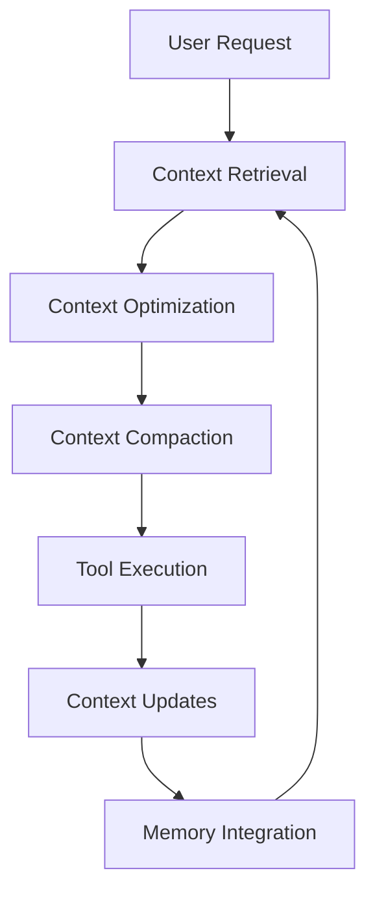

# Droid Context Engineering DNA

## Context Architecture Overview

### Core Principles

Droid operates on **context-first architecture** - optimizing the finite attention budget of LLMs through sophisticated context curation and management strategies.



## Context Engineering Framework

### 1. **Dynamic Context Retrieval**

#### Just-in-Time Context Loading
- **Lightweight identifiers**: Store file paths, queries, references instead of full content
- **Metadata-enriched context**: File hierarchies, naming conventions, timestamps provide signals
- **Progressive disclosure**: Incremental context discovery through exploration

#### Pathway-Based Retrieval System
```python
class ContextPathway:
    def __init__(self):
        self.primary_sources = []  # Core project files (CLAUDE.md, AGENTS.md)
        self.metadata_cache = {}  # File metadata for intelligent retrieval
        self.query_history = []   # Learning patterns from previous searches
        
    def retrieve_context(self, query, context_budget):
        # Prioritize high-signal information
        if self.is_specific_file_reference(query):
            return self.load_file_with_context(query)
        
        # Use semantic search for broader queries
        relevant_files = self.semantic_search(query)
        return self.load_just_enough_context(relevant_files, context_budget)
```

### 2. **Context Compaction Strategy**

#### Multi-Level Compaction
1. **Tool Result Clearing**: Remove raw tool outputs once processed
2. **Summarization Layer**: Compress conversation while preserving key decisions
3. **Structured Note-Taking**: Maintain persistent knowledge outside context window

#### Compaction Implementation
```python
class ContextCompactor:
    def compact_context(self, conversation, context_limit):
        # Phase 1: Remove tool outputs and redundant messages
        compacted = self.remove_tool_results(conversation)
        
        # Phase 2: Summarize while critical details
        summary = self.summarize_conversation(compacted)
        
        # Phase 3: Keep most recent interactions
        recent = self.get_recent_messages(compacted, limit=5)
        
        return summary + recent
```

### 3. **Memory Architecture**

#### Structured Note-Taking System
- **Project Memory.md**: Persistent project knowledge and patterns
- **Task Checklists**: Tracking complex multi-step workflows  
- **Learning Logs**: Capturing successful strategies and patterns

#### External Memory Integration
```python
class DroidMemory:
    def __init__(self):
        self.project_memory = "PROJECT_MEMORY.md"
        self.task_checklists = "TASK_CHECKLISTS.md"
        self.learning_patterns = "LEARNING_PATTERNS.md"
        
    def store_learning(self, context, action, result):
        pattern = self.extract_pattern(context, action, result)
        self.append_to_memory(pattern, self.learning_patterns)
        
    def retrieve_relevant_memories(self, current_context):
        return self.semantic_search_memory(current_context, limit=5)
```

## Context Budget Management

### Attention Budget Optimization

#### Token Efficiency Principles
1. **Minimal Viable Context**: Smallest high-signal token set
2. **Signal-to-Noise Ratio**: Prioritize actionable information over noise
3. **Progressive Refinement**: Start minimal, add context as needed

#### Budget Allocation Strategy
```yaml
context_budget:
  system_prompt: 15%      # Core Droid DNA and behavior
  user_request: 10%       # Current task requirements  
  project_context: 25%    # CLAUDE.md, AGENTS.md patterns
  active_workspace: 30%   # Currently relevant files
  memory_context: 20%     # Learning patterns and notes
```

## Context Engineering Patterns

### 1. **Hybrid Retrieval Strategy**

#### Pre-computation + Just-in-Time Combination
```python
class HybridContextRetriever:
    def build_context(self, request):
        # Pre-computed: Core project knowledge
        static_context = self.load_project_knowledge()
        
        # Just-in-time: Task-specific exploration
        dynamic_context = self.explore_relevant_files(request)
        
        # Memory: Relevant patterns from past work
        memory_context = self.retrieve_patterns(request)
        
        return self.optimize_token_allocation([
            static_context, dynamic_context, memory_context
        ])
```

### 2. **Agent Coordination Context**

#### Sub-Agent Communication Protocol
```python
class SubAgentCoordinator:
    def orchestrate_task(self, complex_request):
        # Decompose into focused sub-tasks
        sub_tasks = self.analyze_dependencies(complex_request)
        
        results = {}
        for task in sub_tasks:
            # Each sub-agent gets clean, focused context
            context = self.build_sub_agent_context(task)
            result = self.deploy_sub_agent(task, context)
            results[task.id] = self.summarize_result(result)
            
        # Lead agent synthesizes with minimal context overhead
        return self.synthesize_results(results)
```

### 3. **Progressive Disclosure Pattern**

#### Layered Information Architecture
```python
class ProgressiveDisclosure:
    def build_progressive_context(self, user_request):
        layers = {
            'immediate': self.get_core_context(user_request),
            'expanded': self.get_related_files(user_request),
            'comprehensive': self.full_codebase_context(user_request)
        }
        
        # Start with immediate, expand as needed
        context = layers['immediate']
        while self.needs_more_context(context, user_request):
            next_layer = self.determine_next_layer(layers, context)
            context = self.add_context_layer(context, next_layer)
            
        return context
```

## Context Integration with Tool System

### Tool-Induced Context Management

#### Context-Aware Tool Selection
```python
class ContextAwareToolRegistry:
    def select_tools(self, context, task):
        # Analyze current context state
        context_analysis = self.analyze_context_density(context)
        
        # Choose tools that provide high signal-to-noise
        if context_analysis.is_specific_file_request():
            return ['Read', 'Edit']  # Direct file operations
            
        elif context_analysis.is_exploratory():
            return ['Grep', 'Glob', 'LS']  # Discovery tools
            
        elif context_analysis.needs_verification():
            return ['Execute', 'Read']  # Testing and validation
```

### Tool Result Optimization
```python
class ToolResultManager:
    def process_result(self, tool_name, result, context_budget):
        if tool_name in ['Read', 'Execute', 'Grep']:
            # Summarize large outputs
            if len(result) > context_budget * 0.3:
                return self.summarize_tool_result(result)
            
        elif tool_name in ['Edit', 'MultiEdit']:
            # Store diffs compactly
            return self.compact_diff_representation(result)
            
        return result
```

## Learning and Adaptation

### Context Pattern Recognition

#### Successful Pattern Storage
```python
class ContextPatternLearner:
    def learn_from_interaction(self, context, sequence, outcome):
        if self.is_successful_outcome(outcome):
            pattern = {
                'context_signatures': self.extract_context_signatures(context),
                'tool_sequence': sequence,
                'success_indicators': self.measure_success(outcome),
                'reusable_elements': self.identify_reusable_elements(context)
            }
            
            self.store_pattern(pattern)
```

#### Adaptive Context Building
```python
class AdaptiveContextBuilder:
    def build_context(self, new_request):
        # Retrieve similar successful patterns
        similar_patterns = self.find_similar_contexts(new_request)
        
        if similar_patterns:
            # Adapt successful context structures
            adapted_context = self.merge_patterns(new_request, similar_patterns)
            return self.optimize_for_current_task(adapted_context)
        else:
            # Fall back to standard context building
            return self.standard_context_building(new_request)
```

## Performance Metrics and Monitoring

### Context Efficiency Measurements

#### Key Performance Indicators
```yaml
context_metrics:
  token_efficiency: "tasks_completed / tokens_used"
  context_rot_resistance: "information_retention / context_depth"
  retrieval_accuracy: "relevant_context_retrieved / total_context"
  compaction_fidelity: "information_preserved / tokens_removed"
```

#### Real-time Monitoring
```python
class ContextMonitor:
    def track_context_usage(self, session):
        metrics = {
            'token_consumption': self.measure_tokens(session),
            'context_rot': self.detect_rot(session),
            'retrieval_success': self.measure_retrieval_accuracy(session),
            'tool_efficiency': self.measure_tool_roi(session)
        }
        
        self.log_metrics(metrics)
        self.adjust_strategies(metrics)
```

## Implementation Guidelines

### Context Engineering Best Practices

#### DO:
- **Start minimal**: Begin with essential context, expand as needed
- **Use metadata**: Leverage file structure, naming, timestamps as signals
- **Compact aggressively**: Remove redundant information frequently
- **Store learnings persistently**: Externalize patterns and knowledge
- **Monitor efficiency**: Track token usage and adapt strategies

#### DON'T:
- **Pre-load everything**: Avoid comprehensive upfront context loading
- **Ignore context budget**: Treat tokens as finite, valuable resource
- **Store tool results**: Clear tool outputs after processing
- **Assume shared knowledge**: Be explicit about project-specific context
- **Optimize prematurely**: Start simple, add complexity as needed

### Integration with Droid DNA

#### DNA Update Protocol
1. **Context Principles**: Integrate context engineering into core DNA
2. **Tool Enhancement**: Make tools context-aware
3. **Memory Systems**: Implement structured note-taking for persistence
4. **Learning Loops**: Capture and reuse successful patterns
5. **Performance Monitoring**: Track context efficiency metrics

This context engineering DNA transforms Droid from a prompt-responsive assistant to an intelligent context-managing agent that maximizes the utility of every token while maintaining coherence across extended interactions and complex workflows.
